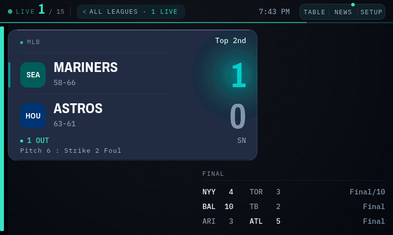
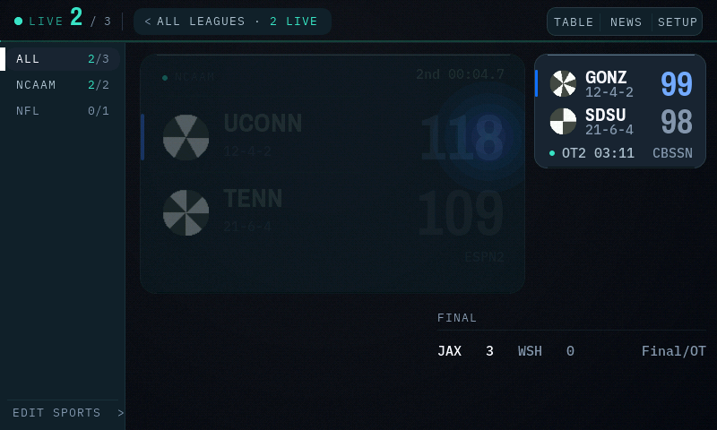
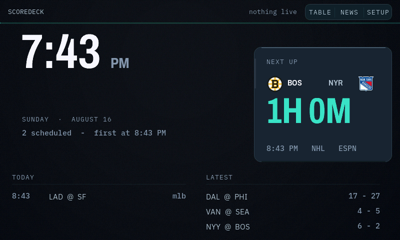

<div align="center">

# ScoreDeck

**Live scores for the teams you follow, on a 7-inch glass panel on your desk.**

Twenty-six leagues, real team logos, a hero card for the game that matters,
score alerts, standings, lineups, a news reader — and when nothing is on, a
clock with a countdown to first pitch. No cloud account. No subscription.
One small proxy you run yourself.

[](docs/PLAN.md) [](docs/HARDWARE.md) [](https://lvgl.io) [](docs/DEPLOY.md) [](https://mrronco.github.io/ScoreDeck/flasher/) [](LICENSE)



<sub>Live capture off the device via <code>GET /screen.bmp</code> — the actual framebuffer on a
Saturday evening, not a mockup. One game live, so the board promotes it to the <b>hero card</b>:
logos, records, the leading score in the team's own colour under a soft bloom, the count of outs,
and the live pitch line (<code>Pitch 6 : Strike 2 Foul</code>) straight off the wire. Finished
games drop into the ledger below. The green dot on <code>NEWS</code> means unread stories; the
teal thread at the left edge is the league rail's collapsed spine.</sub>

</div>

---

## What it does

ScoreDeck turns a Waveshare 7-inch ESP32-S3 touch panel into a standalone
scoreboard for **your** teams. A small proxy (Docker, one command) does the
heavy lifting against ESPN's public feeds; the panel polls it for a ~3 KB
payload and spends its silicon on rendering.

| | |
|---|---|
| **Follows your teams** | Favourites get a gold ring, sort first, tighten the poll while they play, and fire a takeover alert when they score. |
| **Five score models, 26 leagues** | Two-sided, sets, leaderboard, grid and race — so golf, tennis and F1 render properly instead of as fake head-to-heads. Adding a league is a registry row, not a firmware change. |
| **A hero when it's earned** | One live game worth watching becomes a half-screen card with logos, win probability, and the last play. Twelve games become a dense grid. The board chooses. |
| **Real logos, solved chips** | Team marks are fetched once, pre-scaled on-device, and drawn on a ground *measured* to preserve their ink — a dark crest never disappears into a dark tile. |
| **Colour is semantics** | One teal accent means "live, or touch this" — nothing else. Team colours carry identity, luminance carries game state, amber means something is at stake right now. |
| **Reads the news** | Headlines for your teams, and tapping one opens the full article on the panel — paged like a book, with a progress rail. Video-only and premium items honestly fall back to their summary. |
| **A deliberate idle** | Most hours have no games. The panel becomes a 96 px clock, a countdown to the next fixture, and last night's results — not a grid of dimmed finals. |
| **Configurable from the couch** | League picker, favourites, density and quiet hours live in on-device settings *and* in a browser portal at `http://scoredeck.local/`. Both write the same store. |
| **Says what it knows** | A stale feed reads `AS OF 7:41`, a missing record shows nothing, a capped list says so. The heartbeat under the header is the poll cycle made visible. |

---

## Screens

<div align="center">



<sub><b>The league rail.</b> Collapsed it is a 16 px spine whose segments show each league's share
of tonight's board (teal = live now); open, it is a filter — <code>2/3</code> means two of three
games live. The layouts on the right <b>re-solve for the remaining width</b> rather than sliding
away: the hero narrows from 508 to 430 px and re-measures which team names still fit. Tap a
league to filter, tap EDIT SPORTS to choose which leagues are on the board at all.</sub>


<sub><b>The news reader.</b> Stories are typeset in a centred 560 px column — ~70 characters a
line, book measure — and paged, because this panel repaints a page in one crisp ~230 ms pass but
redraws continuous scrolling at a jank nobody should read through (it was built, measured, and
rejected). Tap anywhere or swipe up for the next page, swipe down to go back; the <code>1/5</code>
counter and the right-edge thumb answer "how much is left" before you commit. Page breaks are found
by binary-searching LVGL's own text layout, so the paginator and the renderer cannot disagree.</sub>



<sub><b>The idle screen.</b> Up for more hours than any other. The clock hangs from its ink, not
its glyph box — a leading <code>1</code> and a leading <code>8</code> start their ink ~10 px apart
in a tabular face, and the panel corrects for it — with the next fixture counting down beside it
and yesterday's finals below. The same three nav buttons as the board, because idle is where you
actually are when you want the standings.</sub>

</div>

The rest — standings tables, game detail with box score, lineups with player
sheets, on-device settings, first-boot Wi-Fi onboarding — are on the panel;
the design system behind them (surface ladder, state inks, the contrast
solver, the motion budget) is documented in [`docs/UI.md`](docs/UI.md).

---

## How it works

```
ESP32-S3 panel  ──one HTTP call per poll──▶  your proxy  ──▶  ESPN public feeds
   the board                                 ~3 KB JSON        up to ~1.2 MB JSON
```

The device has tens of KB of free heap; ESPN's golf scoreboard alone is
1.2 MB. So a small proxy aggregates the leagues you follow, normalises five
sports' worth of shapes into one wire format, diffs scores to detect events,
and hands the panel something it can parse in milliseconds. Logos are built
once by the proxy tooling and served as pre-decoded RGB565 blobs.

**You run your own proxy.** There is no shared instance and the firmware
ships with an empty proxy URL — this keeps you inside ESPN's public-facing
rate expectations and keeps your viewing habits on your own hardware. A
Docker container on any always-on box is the recommended shape; a free
Cloudflare Worker also works. See [`docs/DEPLOY.md`](docs/DEPLOY.md) and
[`docs/OPEN_SOURCE.md`](docs/OPEN_SOURCE.md).

---

## Hardware

One board, nothing to solder: the **Waveshare ESP32-S3-Touch-LCD-7** —
the same panel as [AirRadar](https://github.com/MrRonco/AirRadar), so the two
projects share a bill of materials and a pile of hard-won board knowledge.

| | |
|---|---|
| **MCU** | ESP32-S3-WROOM-1-N16R8 — dual-core LX7 @ 240 MHz, Wi-Fi |
| **Flash / PSRAM** | 16 MB QIO / **8 MB OPI** — the framebuffer lives in PSRAM |
| **Display** | 7" IPS, 800×480, RGB565 parallel, GT911 five-point touch |
| **Power** | USB-C, ~500 mA |

> [!IMPORTANT]
> The Arduino **PSRAM setting must be OPI PSRAM**. Set wrong, the framebuffer
> fails to allocate and you get a black screen or a boot loop.

The board's quirks — the UART slide switch that gates flashing, the GT911
address lottery, the macOS CH343 driver — are the same as AirRadar's and are
documented honestly in its
[hardware notes](https://github.com/MrRonco/AirRadar#quirks-worth-knowing-before-you-buy)
and in [`docs/HARDWARE.md`](docs/HARDWARE.md).

---

## Install

Two pieces: the **proxy** on any always-on box, then the **panel**.

### 1 · The proxy — one command

On any machine with Docker (a NAS, a Pi, a home server):

```bash
curl -fsSL https://raw.githubusercontent.com/MrRonco/ScoreDeck/main/install.sh | bash
```

The launcher checks for Docker, fetches the proxy, generates an auth token,
builds the container and starts it — then prints the URL and token the panel
needs. Re-running it updates in place; your token and settings survive.

<details>
<summary><b>Manual / compose, Unraid VLANs, Cloudflare Workers…</b></summary>

```bash
git clone https://github.com/MrRonco/ScoreDeck.git
cd ScoreDeck/proxy
echo "SD_TOKEN=$(openssl rand -hex 24)" > .env
docker compose up -d --build
```

- **Unraid with an isolated IoT VLAN**: `docker-compose.unraid.yml` puts the
  container directly on the panel's VLAN with its own IP — no firewall holes.
  A boot script and a Docker-tab template ship in [`unraid/`](unraid/).
- **Cloudflare Workers**: `proxy/wrangler.toml` deploys the same code to the
  free tier with a cache-warming cron.
- Full walkthrough, including how to *measure* whether your panel can reach a
  candidate host before building anything: [`docs/DEPLOY.md`](docs/DEPLOY.md).

</details>

### 2 · The panel — one click

Open the **[web flasher](https://mrronco.github.io/ScoreDeck/flasher/)** in
desktop Chrome or Edge, plug the board in over USB-C, hit **Install**.

> [!TIP]
> *"No serial data received"* → flip the **UART slide switch** on the board.
> It catches everyone once.

Then, on first boot: the panel scans for Wi-Fi and takes the password on a
touch keyboard; enter the proxy URL and token (or do it from the browser
portal it announces); pick your leagues and favourites. Done.

To **update** a panel that is already set up, use OTA from the portal instead
of re-flashing — settings live in NVS and a merged-image flash erases them.

### From source

```bash
FQBN='esp32:esp32:esp32s3:PSRAM=opi,FlashSize=16M,PartitionScheme=app3M_fat9M_16MB,USBMode=hwcdc'
arduino-cli compile --fqbn "$FQBN" firmware/ScoreDeck
arduino-cli upload  --fqbn "$FQBN" -p /dev/cu.wchusbserial* firmware/ScoreDeck
```

Or `tools/restore-panel.sh --build <port>`, which is what development uses.
Pinned, load-bearing versions: esp32 core 3.3.10, LVGL 8.3.x, ArduinoJson
6.21.x. `firmware/lv_conf.h` must sit beside the LVGL library folder.

The desktop harness (`cd desktop && make`) renders every screen against the
real firmware code with fixture data — most of the UI in this repo was
verified there, pixel-measured, before ever touching the panel.

---

## The browser portal & API

`http://scoredeck.local/` serves a setup portal — Wi-Fi, proxy, leagues,
favourites, density, quiet hours — that writes the same settings store as the
on-device screens.

| Endpoint | Purpose |
|---|---|
| `GET /api/config` · `POST` | Read or write every setting |
| `GET /api/state` | The board as JSON |
| `GET /api/diag` | Heap, largest block, RSSI, poll age/latency, reset reason |
| `GET /api/probe?url=` | Device-side fetch test — "is it my firewall or the firmware?" |
| `GET /screen.bmp` | The live 800×480 framebuffer |
| `POST /api/reboot` · `/api/forget` · `/api/reset` | Lifecycle |

Every screenshot in this README labelled "live capture" came from
`/screen.bmp`. The diagnostics exist because this board's USB serial is
awkward once deployed — the device reports on itself over HTTP.

---

## Data, trademarks, licence

- **Scores and news** come from ESPN's public, keyless site feeds via *your*
  proxy. This project is not affiliated with or endorsed by ESPN or any
  league. Be a good citizen: the proxy caches aggressively and the panel
  polls once a minute (12 s when a followed team is live).
- **Team logos and player photos are trademarks and likenesses.** They are
  **never** in this repository or its images — the proxy tooling builds them
  on your machine, for your own device. [`docs/OPEN_SOURCE.md`](docs/OPEN_SOURCE.md)
  is the full reasoning.
- **Fonts**: Archivo, IBM Plex Sans/Mono (OFL), with two glyphs from Noto
  Sans Symbols 2 (OFL). Regeneration is scripted in `tools/build-fonts.sh`;
  licence texts in [`LICENSES/`](LICENSES) and
  [`THIRD-PARTY-NOTICES.md`](THIRD-PARTY-NOTICES.md).
- **Code**: GPL-3.0-or-later. [`LICENSE`](LICENSE).

---

<div align="center">
<sub>Built with a desktop LVGL harness, a three-way design/engineering review
loop, and a panel that got reflashed more times than it deserved.</sub>
</div>
