<div align="center">

# ScoreDeck

**Live sports scores for the teams you follow, on a 7-inch glass panel on your desk.**

Twenty-six leagues across five different *kinds* of sport, real team logos, a hero card for
the game that matters, score-alert takeovers, standings, box scores, lineups, a news reader —
and when nothing is on, a clock counting down to first pitch. No cloud account,
no subscription, no API keys. One small proxy you run yourself.

[](docs/PLAN.md) [](docs/HARDWARE.md) [](https://lvgl.io) [](docs/DEPLOY.md) [](https://mrronco.github.io/ScoreDeck/flasher/) [](SECURITY.md) [](LICENSE)

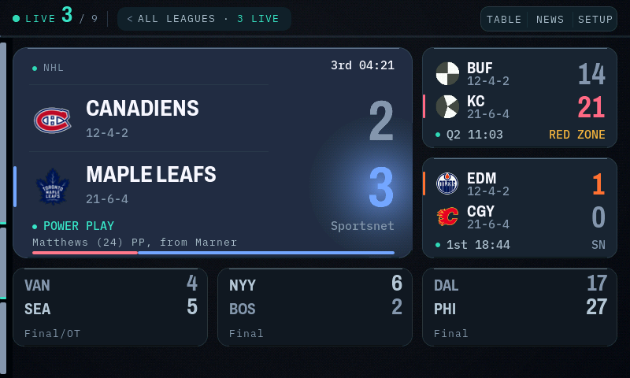

<sub><b>One live game worth watching becomes the whole screen.</b> The hero carries both clubs'
real marks, records, and the leading score in <b>Toronto's own blue</b> — lifted to a measured
contrast ratio against the card it sits on, never the raw brand hex — under a glow that is
pre-composited per team rather than blended at draw time, because a runtime gradient on a
16-bit panel bands into visible rings. <code>POWER PLAY</code> is amber because
<code>uiIsTense()</code> says this moment earned it; the situation line on an ordinary
possession is not. The bar along the foot is live win probability, the only number on a
scoreboard that moves continuously. Down the right, two more live games; across the bottom,
three finished ones as result cards on the same grid.</sub>

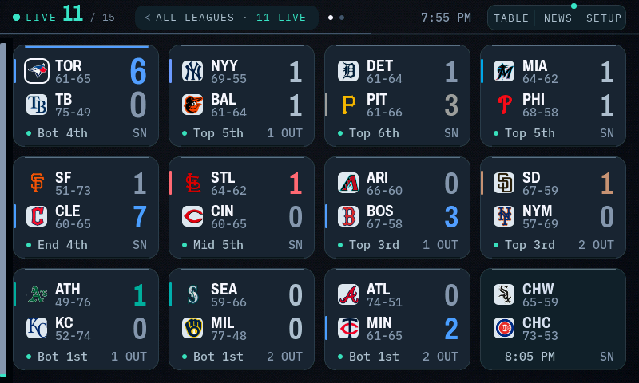

<sub><b>And the same firmware on the actual desk.</b> Not a mockup and not a re-render — this one
came off the device over <code>GET /screen.bmp</code>, which streams the live framebuffer. Every
other image here is the same UI code compiled against SDL, which is how the fine measurements in
this README were taken.</sub>

</div>

---

## What it does

ScoreDeck turns a Waveshare 7-inch ESP32-S3 touch panel into a standalone scoreboard for
**your** teams. A small proxy — one command, on any always-on box — does the aggregating
against ESPN's public feeds; the panel polls it for a ~3 KB payload and spends its silicon
on rendering.

| | |
|---|---|
| **Follows your teams** | Favourites sort first, get a gold ring, tighten the poll while they play, and fire a full-screen takeover when they score. |
| **Five score models, 26 leagues** | Two-sided, sets, leaderboard, grid and race — so tennis, golf and F1 render as what they *are* rather than as fake head-to-heads. Adding a league is a row in the proxy registry, not a firmware change. |
| **The board chooses its own shape** | One live game worth watching becomes a half-screen hero. Twelve games become a dense grid. A quiet night becomes a clock. You never pick a layout. |
| **Real logos, solved grounds** | Team marks are fetched once, pre-scaled on-device, and drawn on a ground *measured* to preserve their ink, so a dark crest never disappears into a dark tile. |
| **Colour means something** | Exactly one accent for "happening now"; amber only when a moment or the system earns it; team colour as an independent, contrast-solved channel. All three are kept apart by lightness, not by hue. |
| **Reads the news** | Headlines for your teams, and tapping one opens the full article on the panel — paged like a book, with a progress rail. |
| **Says what it doesn't know** | A stale feed reads `AS OF 7:41`, a missing record shows nothing rather than a zero, a capped list says so, and the heartbeat under the header is the poll cycle made visible. |
| **Configurable from the couch** | Every setting lives on the panel *and* in a browser console. Both write the same store. |

---

## The screens

<div align="center">

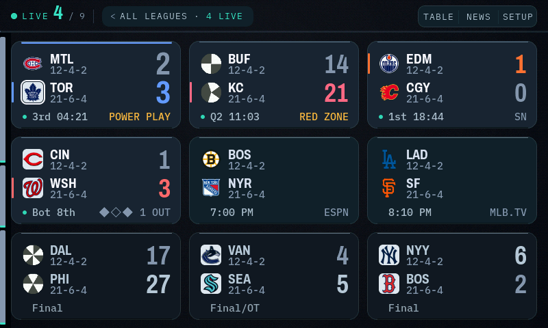

<sub><b>The grid.</b> Nine games, three states. Luminance carries state — live tiles sit highest
on the surface ladder, scheduled below them, finished lowest — so you read the board before you
read a number. The 3 px edge light marks the <i>leading</i> team's row and swaps ends when the
lead changes. Scheduled games show no score placeholder at all: the start time already says the
game hasn't begun, and twenty floating dashes read as damage.</sub>

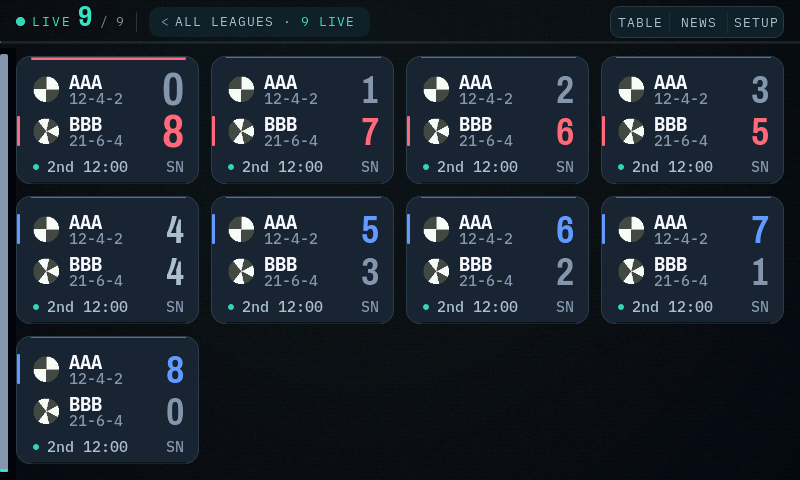

<sub><b>Dense, on a busy night.</b> Twelve games at 183 px wide. Everything is derived from the
tile width rather than hardcoded, so the same code lays out Roomy at three-up and Dense at
four-up without a second layout pass — and the situation vocabulary shortens itself when the
right-hand column can't hold the long form.</sub>

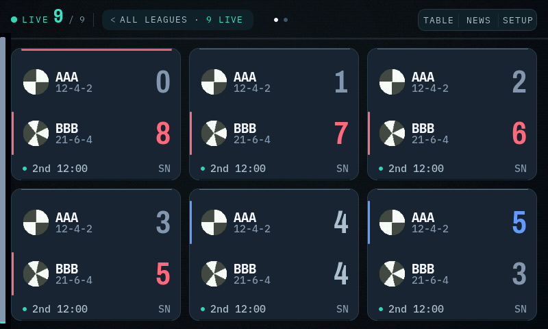

<sub><b>Roomy, on a quiet night.</b> The third density. The board picks between the three from how
many games there actually are — on a desk, the answer to a quiet evening is to recruit content, not
to inflate the type, so AUTO only reaches for Roomy when there is genuinely little to show.</sub>

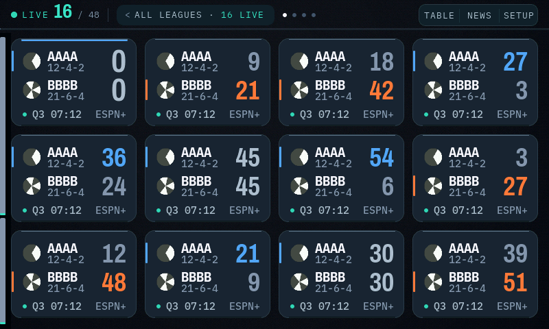

<sub><b>Forty-eight games, and the pager.</b> A November Saturday has 300+ D1 basketball games,
so the board caps what it holds, sorts by leverage, and pages the rest — the dots in the header say
"there is more" far better than "1 / 4" does, and they hide themselves when paging is unavailable.
The placeholder <code>AAAA</code>/<code>BBBB</code> clubs are deliberate: this is a synthetic
stress fixture whose job is to prove the cap, the pager and the layout under load, not to look
like a real night.</sub>

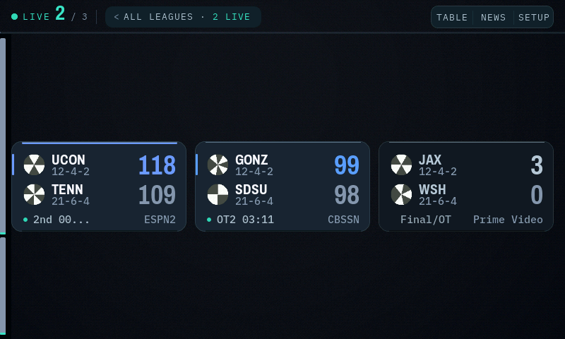

<sub><b>The awkward cases, on purpose.</b> Long club names beside three-digit basketball scores.
The name column takes exactly the pixels the <i>rendered</i> digits leave free rather than a width
reserved for "999", so a long name only shortens in the case that actually collides.</sub>

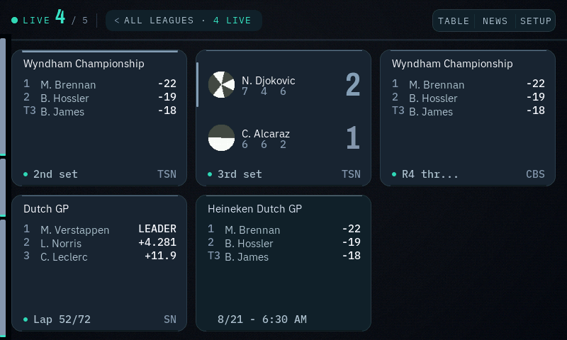

<sub><b>Five score models, one board.</b> Tennis carries per-set boxes where a club record would
go. Golf is a leaderboard of positions and scores to par — it has no "sides", so it is never
promoted into a two-sided hero. F1 is a session with a start time. The device implements the
five <i>shapes</i> a sport can take; the proxy maps 26 leagues onto them.</sub>

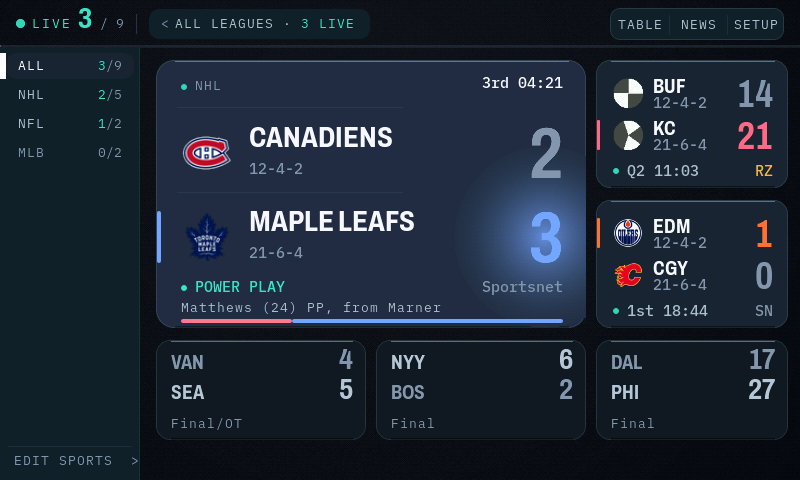

<sub><b>The league rail.</b> Collapsed it is a 16 px spine whose segments show each league's share
of tonight's board; open, it is a filter — <code>2/3</code> means two of three games live. The
layouts to its right <b>re-solve for the remaining width</b> rather than sliding away: the hero
narrows from 508 to 430 px and re-measures which team names still fit.</sub>

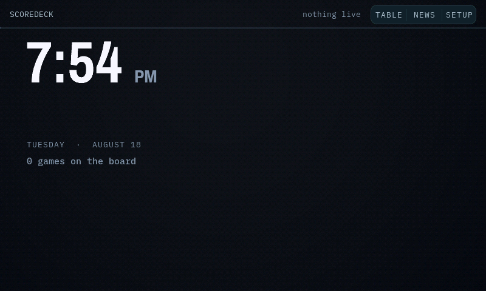

<sub><b>The idle screen — up for more hours than any other.</b> Most of the day has no games, and
a grid of dimmed finals is a sad object, so the panel becomes a clock. The digits hang from their
<i>ink</i>, not their glyph box: a leading <code>1</code> and a leading <code>8</code> start their
ink ~10 px apart in a tabular face, and the panel corrects for it so the clock doesn't visibly
shift on the hour.</sub>

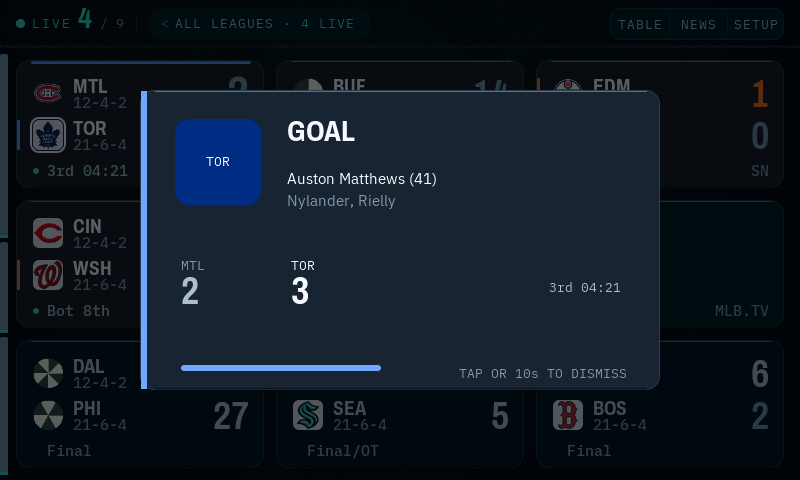

<sub><b>The takeover.</b> When a followed team scores, the panel stops being a board. The team's
colour here is lifted against the card it lands on — it used to be the raw wire colour, which put
two thirds of real kits below 3:1 and rendered Toronto essentially invisible on the product's
signature moment.</sub>

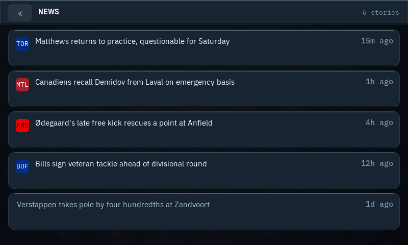
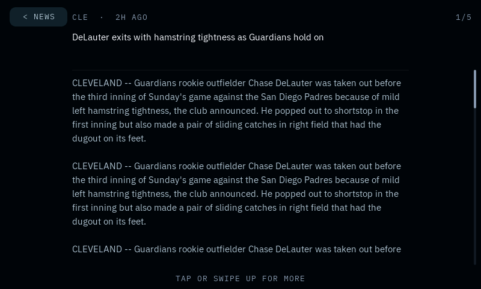

<sub><b>News, and the reader.</b> Tapping a headline opens the article on the panel. It is
<b>paged, not scrolled</b> — this display repaints a page in one crisp pass and redraws
continuous scrolling at a jank nobody should read through, which was built, measured and
rejected. Tap anywhere or swipe up for the next page, swipe down to go back; a counter and a
right-edge thumb answer "how much is left" before you commit. Page breaks are found by
binary-searching LVGL's own text layout, so the paginator and the renderer cannot disagree.</sub>

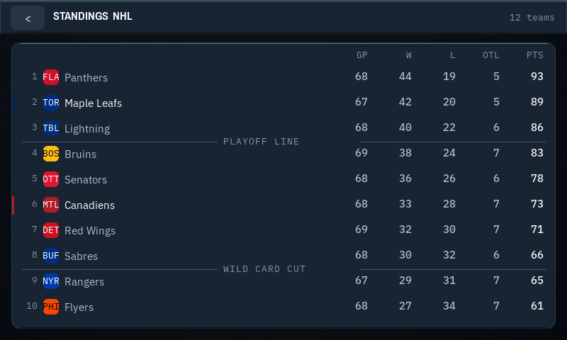
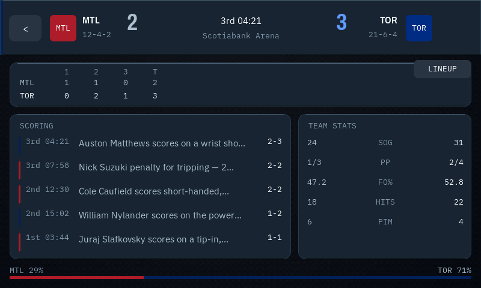
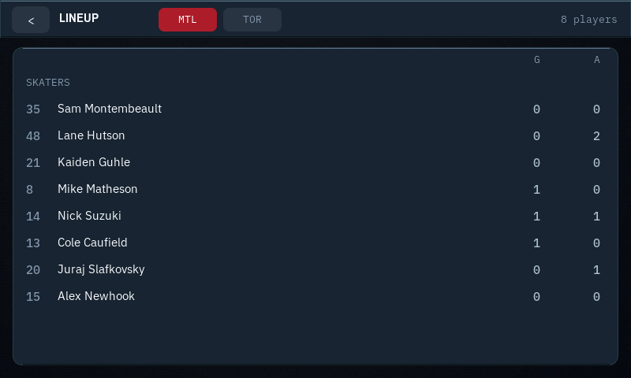
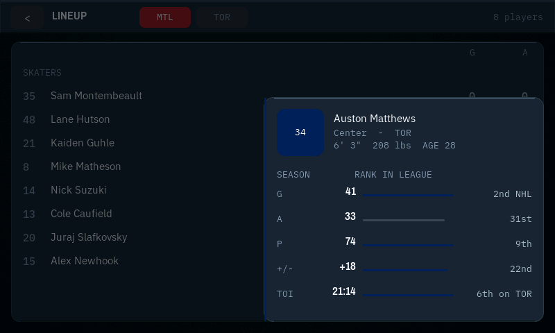

<sub><b>Everything is one tap deep.</b> Standings, the box score, lineups, and a player sheet —
each reachable from the game you were already looking at, and each fetched only when asked for.</sub>

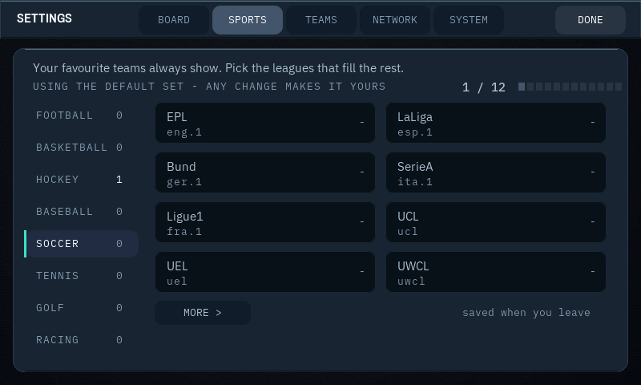
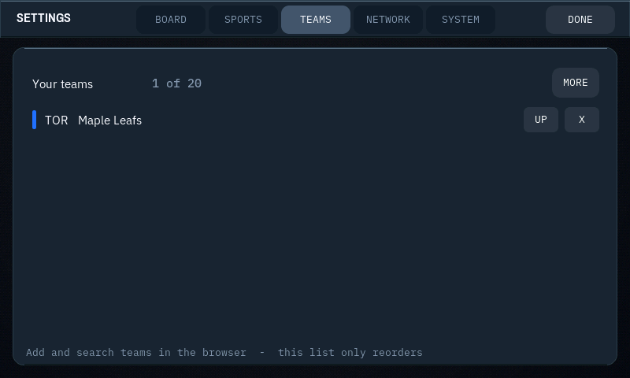

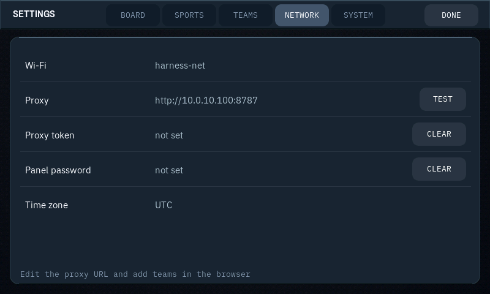
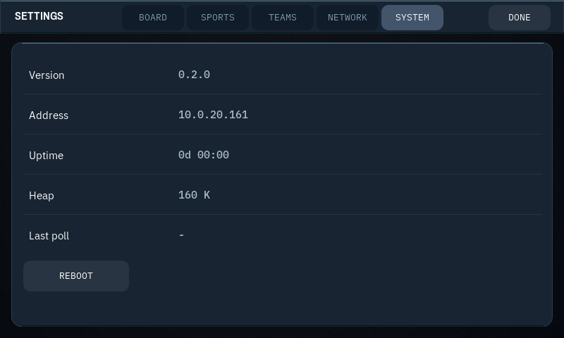

<sub><b>Settings, on the glass.</b> The league picker is fed by a catalog the proxy builds, degrades
to what it already knows when the proxy is unreachable, and counts favourites' leagues against the
same twelve-league cap the device can actually parse — so the number in the meter is the truth,
not an aspiration.</sub>

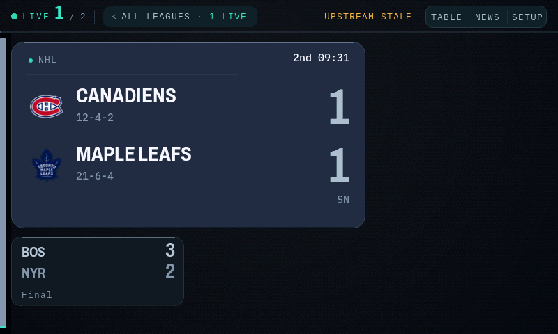


<sub><b>Honest failure.</b> Two of the three fault states. With no proxy configured the header
says <code>no proxy configured</code> and the summary says <code>0 games on the board</code> — the
panel does not pretend, and it does not show a blank grid and leave you guessing. When a configured
feed goes stale instead, the header carries <code>AS OF 7:41</code> rather than presenting old
scores as current. No proxy, no Wi-Fi, and a feed that has stopped moving are three different
messages because they need three different fixes. (Neither screen tells you <i>how</i> to fix it —
that lives in the browser console and on the SETUP screen.)</sub>

</div>

---

## The visual system

The panel is 800×480 in **RGB565** — 5 bits of red, 6 of green, 5 of blue — viewed from about
two feet away. Nearly every rule below exists because of one of those two facts.

**Luminance encodes state; colour encodes team.** Five surfaces climb in measured steps —
plate `#04070E`, final `#101825`, scheduled `#16202E`, live `#1B2636`, hero `#222E40` — and each
one gets its **own solved ink tiers**, not a global grey scaled by opacity. Every tier clears a
contrast floor against the specific surface it is drawn on (primary ≥10:1, secondary ≥7:1,
tertiary ≥4.5:1). An earlier build faded whole tiles with opacity instead, and a finished game's
record landed at 1.73:1 — it looked like a tile that had failed to load.

**One accent, and it has to earn its pixels.** `#3BE0C0` means *happening now, or touch this*, and
nothing else may use it. That rule was written down long before it was true: an audit found
**92.7% of every accent pixel on the board was the decorative rail spine** and 1.8% was signal,
while on the idle screen 94% of it counted down to a game that hadn't started. The spine is drawn
in ink now, with a small accent cap only for leagues that are actually live.

**The pulse is five solid colours, not an opacity ramp.** LVGL quantises opacity to
`(opa + 4) >> 3` — 26 levels, not 256 — and blends toward the surface, losing chroma along with
lightness. The pulsing dot and the flat accent bar beside it were therefore *genuinely different
colours*, and the dot bottomed out at 3.79:1, below AA. Five pre-solved rungs replace it.

**Team colour is a channel, and it is kept in its own lane.** ~3,000 club colours arrive as
content. `teamInkFor()` lifts each one to **5.5:1** against the surface it will really be drawn on,
then clamps it to **L\* 68**. Before that, team colour was drawn at two different ratios — the same
club rendered *16 L\* apart on one tile* — and the brighter of the two put team colours at L\* 69–83,
straddling the amber at 78.2 and the teal at 81.8. There was no lightness gap between content and
chrome at all. The ceiling opens an **8.4 L\* moat**, so the eye can tell which colours carry meaning
before it identifies any of them. The contrast floor always outranks the ceiling.

**Gradients are baked, never drawn.** A runtime gradient bands visibly at 16 bits, so the plate is
a Bayer-dithered asset generated once at boot. The hero's glow is now **pre-composited per team**:
the blend is done in 8-bit against the known card fill, the *increment* is dithered (dithering the
absolute value would texture the flat background, since the fill isn't exactly representable in
565), quantised once, and handed to LVGL as opaque pixels it can copy without blending. Measured
across the glow's radius, mean flat-run length went **10.75 px → 1.62 px**.

**Everything a row contains shares one optical centre**, derived from measured glyph ink rather
than point sizes — badge, name block and score used to sit 7.5 px apart inside a 42 px band. Five
radii, one line hue at three opacities, six greys.

---

## Engineering constraints

The display's DMA continuously scans a 768 KB framebuffer out of PSRAM, and it consumes most of
the available memory bandwidth all the time. Every pixel the CPU writes competes with the panel
refresh, which is why the rules below are not stylistic.

- **~50,000 px per tick** sustained is the invalidation budget; a full-screen repaint is ~230 ms.
  `LV_INV_BUF_SIZE` is 64 regions.
- **`lv_obj_add_flag`/`clear_flag` are not idempotent** — they invalidate whether or not the flag
  changed. Every visibility and style write on a per-poll path is change-cached. A single missed
  gate on two container roots was repainting **248,144 px — 64.6% of the screen — once a minute for
  no visual change**.
- **Motion is event-driven and finite.** A score change rolls the digits over 200 ms; the win
  probability tweens; a tile flare exhales. The pulsing dots are the only continuous motion, and
  nothing is ever allowed to delay data.
- **`lv_img` zoom is not trusted.** It clips downscales and offsets upscales on this build
  (measured with a calibration spike), so logos are *pre-scaled* into the exact pixels wanted.
- **Fonts are pre-baked bitmap faces** with the narrowest glyph range each job needs — which is why
  the whole set costs less flash than one general-purpose face, and why `make lint` fails the build
  if a label is assigned a face that cannot render it.

Firmware is currently **1.67 MB, 52% of the 3 MB app partition**.

---

## How it works

```
ESP32-S3 panel  ──one HTTP call per poll──▶  your proxy  ──▶  ESPN public feeds
   the board                                 ~3 KB JSON        up to ~1.2 MB JSON
```

The device has tens of KB of free internal heap; ESPN's golf scoreboard alone is 1.2 MB. So the
proxy aggregates the leagues you follow, normalises five sports' worth of shapes into one wire
format, diffs scores to detect events, and hands the panel something it can parse in
milliseconds. Logos are built once by the proxy tooling and served as pre-decoded RGB565 blobs.

**You run your own proxy.** There is no shared instance and the firmware ships with an empty proxy
URL — this keeps you inside ESPN's public-facing rate expectations and keeps your viewing habits on
your own hardware. See [`docs/DEPLOY.md`](docs/DEPLOY.md).

---

## Hardware

One board, nothing to solder: the **Waveshare ESP32-S3-Touch-LCD-7** — the same panel as
[AirRadar](https://github.com/MrRonco/AirRadar), so the two projects share a bill of materials.

| | |
|---|---|
| **MCU** | ESP32-S3-WROOM-1-N16R8 — dual-core LX7 @ 240 MHz, Wi-Fi |
| **Flash / PSRAM** | 16 MB QIO / **8 MB OPI** — the framebuffer lives in PSRAM |
| **Display** | 7" IPS, 800×480, RGB565 parallel, GT911 five-point touch |
| **Power** | USB-C, ~500 mA |

> [!IMPORTANT]
> The Arduino **PSRAM setting must be OPI PSRAM**. Set wrong, the framebuffer fails to allocate
> and you get a black screen or a boot loop. It is the first thing to check on any "the screen is
> dead" report.

The board's quirks — the UART slide switch that gates flashing, the GT911 address lottery, the
macOS CH343 driver — are documented in [`docs/HARDWARE.md`](docs/HARDWARE.md).

---

## Install

Two pieces: the **proxy** on any always-on box, then the **panel**.

### 1 · The proxy — one command

```bash
curl -fsSL https://raw.githubusercontent.com/MrRonco/ScoreDeck/main/install.sh | bash
```

Checks Docker, fetches the proxy, generates an auth token, builds and starts the container, then
prints the URL and token the panel needs. Re-running updates in place. A published multi-arch image
is also available at `ghcr.io/mrronco/scoredeck-proxy`.

<details>
<summary><b>Unraid with an isolated IoT VLAN, Cloudflare Workers, manual compose…</b></summary>

- **Unraid**: `docker-compose.unraid.yml` puts the container directly on the panel's VLAN with its
  own IP, so no firewall hole is needed. A boot script and Docker-tab template ship in [`unraid/`](unraid/).
- **Cloudflare Workers**: `proxy/wrangler.toml` deploys the same code with a cache-warming cron.
- Full walkthrough, including how to *measure* whether your panel can reach a candidate host before
  building anything: [`docs/DEPLOY.md`](docs/DEPLOY.md).

</details>

### 2 · The panel — one click

Open the **[web flasher](https://mrronco.github.io/ScoreDeck/flasher/)** in desktop Chrome or Edge,
plug the board in over USB-C, hit **Install**. The `esp-web-tools` component is vendored and
integrity-pinned rather than loaded from a CDN.

> [!TIP]
> *"No serial data received"* → flip the **UART slide switch** on the board. It catches everyone once.

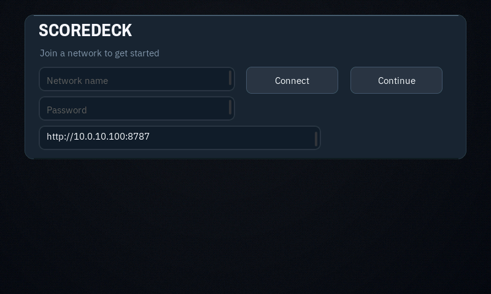

On first boot the panel scans for Wi-Fi and takes the password on a touch keyboard; then enter the
proxy URL and token, pick leagues and favourites — on the panel, or from the browser console it
announces. To **update** a panel that is already set up, use OTA rather than re-flashing: settings
live in NVS and a merged-image flash erases them.

### From source

```bash
FQBN='esp32:esp32:esp32s3:PSRAM=opi,FlashSize=16M,PartitionScheme=app3M_fat9M_16MB,USBMode=hwcdc'
arduino-cli compile --fqbn "$FQBN" firmware/ScoreDeck
arduino-cli upload  --fqbn "$FQBN" -p /dev/cu.wchusbserial* firmware/ScoreDeck
```

Pinned, load-bearing versions: esp32 core 3.3.10, LVGL 8.3.x, ArduinoJson 6.21.x.
`firmware/lv_conf.h` must sit beside the LVGL library folder.

---

## Development: the desktop harness

Most of the UI in this repo was designed, measured and corrected **without touching the panel**.

```bash
cd desktop && make                       # builds the real firmware UI against SDL
./scoredeck-ui                           # interactive: 1..11 scenarios, b/i/g/s/n/l screens
./scoredeck-ui --shot out.bmp --scenario 10 --settle 450   # headless capture
make lint                                # fails if any label uses a face that can't render it
```

The harness compiles the **actual** `ui/*.cpp` sources against LVGL with fixture data, so a render
is the same code path the device runs, in the same RGB565. Eleven scenarios cover the edge cases
that are hard to wait for — a 48-game Saturday, three-digit scores, accented names, a stale feed,
no proxy. Every screenshot in this README came out of it.

`--settle` matters more than it sounds: without it, captures land *inside* one-shot animations. Every
FEATURE screenshot in this repository's history was accidentally taken at 33% opacity mid-reveal,
which is part of why a banding defect in the hero's glow survived an entire polish pass unnoticed.

---

## The browser console & API

`http://scoredeck.local/` serves a single-page console — board mirror, settings, diagnostics, a live
panel preview that streams the device's own framebuffer into the page, and OTA upload.

| Endpoint | Purpose |
|---|---|
| `GET`/`POST` `/api/config` | Read or write every setting |
| `GET /api/state` | The board as JSON |
| `GET /api/diag` | Heap, largest block, RSSI, poll age/latency, reset reason, declines |
| `GET /api/probe` | Device-side fetch test — "is it my firewall or the firmware?" |
| `GET /api/relay?p=` | Fetch one allow-listed proxy path *through* the device |
| `GET /screen.bmp` | The live 800×480 framebuffer |
| `POST /update` | OTA firmware upload (requires a portal password) |

---

## Security

A full third-party static review was run in August 2026 and every finding remediated; the report is
archived at [`docs/SECURITY-REVIEW-2026-08.md`](docs/SECURITY-REVIEW-2026-08.md) and the policy at
[`SECURITY.md`](SECURITY.md). In short:

- **Privileged routes fail closed.** Firmware update, Wi-Fi changes and factory reset require a
  portal password to *exist* — an unconfigured panel refuses them rather than letting any device on
  the LAN flash it.
- Portal auth is **Digest** with lockout; the console pins its inline script by **CSP hash**; the
  flasher's third-party JS is **vendored and SRI-pinned**.
- **TLS is verified** against the CA bundle by default; a self-signed LAN proxy needs an explicit
  opt-out.
- The proxy **fails closed** without a token, is bounded against unbounded upstreams, and is
  reproducible from a committed lockfile.

It is a LAN appliance. Do not expose it to the internet.

---

## Data, trademarks, licence

- **Scores and news** come from ESPN's public, keyless site feeds via *your* proxy. This project is
  not affiliated with or endorsed by ESPN or any league.
- **Team logos and player photos are trademarks and likenesses.** They are **never** in this
  repository or its images — the proxy tooling builds them on your machine, for your own device.
  [`docs/OPEN_SOURCE.md`](docs/OPEN_SOURCE.md) is the full reasoning.
- **Fonts**: Archivo, IBM Plex Sans/Mono (OFL), with two glyphs from Noto Sans Symbols 2 (OFL).
  Regeneration is scripted; licence texts in [`LICENSES/`](LICENSES).
- **Code**: GPL-3.0-or-later. [`LICENSE`](LICENSE).

---

<div align="center">
<sub>Built with a desktop LVGL harness, a contrast solver, an adversarial review loop,
and a panel that got reflashed more times than it deserved.</sub>
</div>
